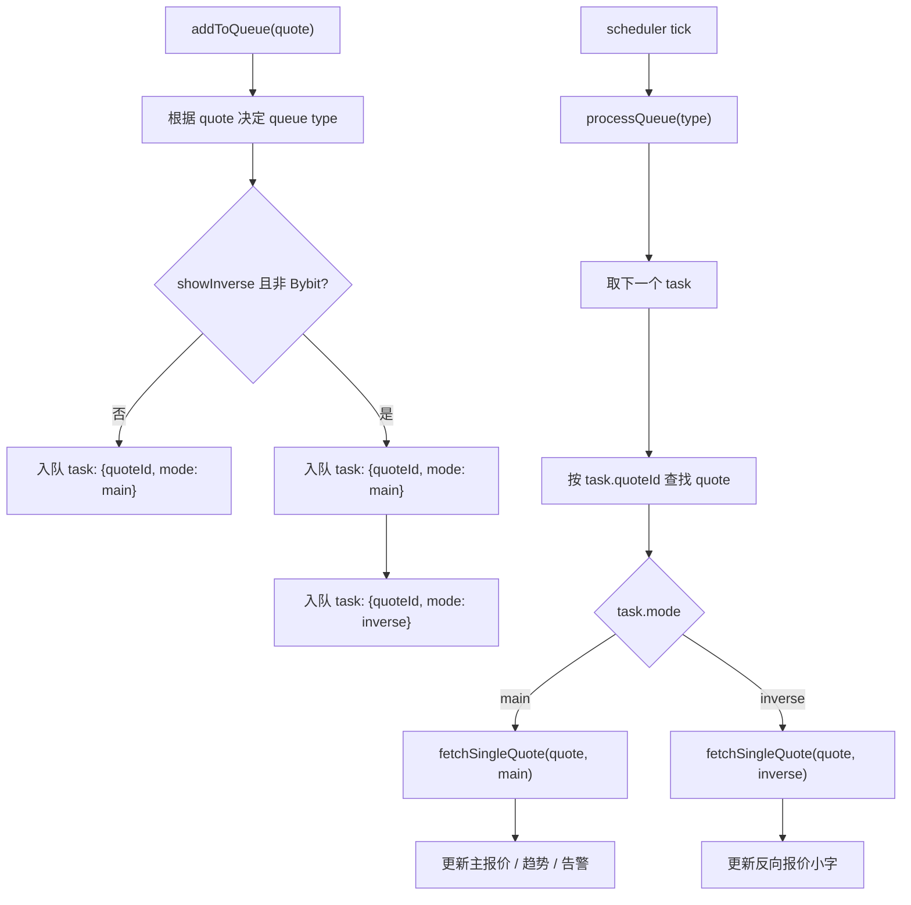

# 请求队列（任务队列版）说明

## 目的

把 `showInverse` 的反向报价纳入队列调度，避免在一次 `fetchSingleQuote()` 中与主向并发请求，降低实际 QPS 放大。

## 核心变化

- 旧模型：队列里存 `quote`
  - 轮到一个 `quote` 后，`fetchSingleQuote()` 里可能同时发 `main + inverse`（并发）
- 新模型：队列里存 `task`
  - 任务结构：`{ quoteId, mode: 'main' | 'inverse' }`
  - 每次 scheduler tick 只处理一个任务，因此 `1 tick ≈ 1 次请求`

## 任务生成规则

- `showInverse = false`：只生成 `main` 任务
- `showInverse = true` 且非 `Bybit`：生成 `main` + `inverse` 两个任务

## 队列与执行逻辑

1. `addToQueue(quote)` 按数据源类型（`kyber/zerox/lifi/bybit/solana/sui`）决定进入哪个队列
2. 把 `quote` 展开成一个或两个任务（`main`、`inverse`）
3. `processQueue(type)` 每次轮询取出一个任务
4. 通过 `task.quoteId` 找到当前 quote 配置
5. 调用 `fetchSingleQuote(quote, task.mode)`
6. `main` 模式更新主价格/趋势/告警
7. `inverse` 模式只更新反向小字，不触发主价格告警逻辑

## 为什么更好

- 队列语义更清晰：队列里就是“请求任务”
- QPS 更容易估算：每次 tick 最多发 1 个请求
- 反向报价天然遵守队列和间隔，不再绕过 scheduler
- 不需要维护 `main/inverse` 相位状态（phase）

## 流程图

## 注意事项

- `showInverse` 开关变化时需要 `removeFromQueue(quote.id)` 后再 `addToQueue(quote)`，以重建任务列表
- 启动时已注释 burst 首刷，避免与 scheduler 并行造成瞬时放大
