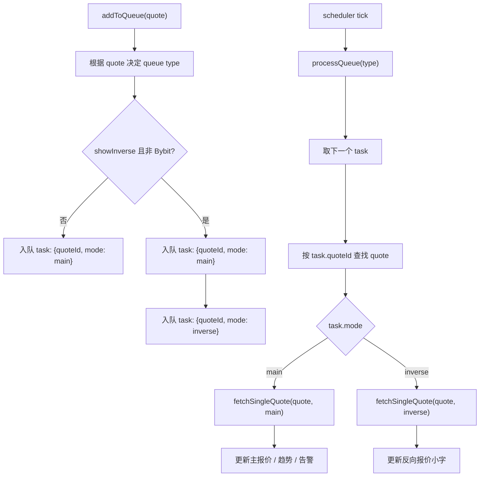

# 请求队列（任务队列版）说明

## 目的

把 `showInverse` 的反向报价纳入队列调度，避免在一次 `fetchSingleQuote()` 中与主向并发请求，降低实际 QPS 放大。

## 核心变化

- 旧模型：队列里存 `quote`
  - 轮到一个 `quote` 后，`fetchSingleQuote()` 里可能同时发 `main + inverse`（并发）
- 新模型：队列里存 `task`
  - 任务结构：`{ quoteId, mode: 'main' | 'inverse' }`
  - 每次 scheduler tick 只处理一个任务，因此 `1 tick ≈ 1 次请求`

## 任务生成规则

- `showInverse = false`：只生成 `main` 任务
- `showInverse = true` 且非 `Bybit`：生成 `main` + `inverse` 两个任务

## 当前有几个队列

当前主看板固定有 `8` 个队列：

- `kyber`
- `zerox`
- `velora`
- `lifi`
- `bybit`
- `solana`
- `sui`
- `starknet`

队列选择规则：

- `Bybit` 走 `bybit`
- `solana` 走 `solana`
- `sui` 走 `sui`
- `starknet` 走 `starknet`
- EVM 链里：
  - `preferredSource = '0x'` 走 `zerox`
  - `preferredSource = 'Velora'` 走 `velora`
  - `preferredSource = 'LI.FI'` 走 `lifi`
  - 其他默认走 `kyber`

## 队列与执行逻辑

1. `addToQueue(quote)` 按数据源类型（`kyber/zerox/velora/lifi/bybit/solana/sui/starknet`）决定进入哪个队列
2. 把 `quote` 展开成一个或两个任务（`main`、`inverse`）
3. `processQueue(type)` 每次轮询取出一个任务
4. 通过 `task.quoteId` 找到当前 quote 配置
5. 调用 `fetchSingleQuote(quote, task.mode)`
6. `main` 模式更新主价格/趋势/告警
7. `inverse` 模式只更新反向小字，不触发主价格告警逻辑

## 为什么更好

- 队列语义更清晰：队列里就是“请求任务”
- QPS 更容易估算：每次 tick 最多发 1 个请求
- 反向报价天然遵守队列和间隔，不再绕过 scheduler
- 不需要维护 `main/inverse` 相位状态（phase）

## 队列之间是否并行

是，并行。

- 每个队列都有自己独立的 `setInterval`
- `updateSchedulers()` 会给每个队列分别启动一个 timer
- 所以 `kyber / zerox / velora / lifi / bybit / solana / sui / starknet` 之间可以同时跑

但每个单独队列内部仍然是串行节奏：

- 一个 queue 的一次 tick 只会处理一个 task
- 同一个 quote 如果上一次请求还没结束，`processQueue()` 不会重复发，而是把当前任务 defer 到队尾
- 这个保护依赖 `activeFetchControllers.has(quote.id)`

所以更准确地说：

- `队列内`：按 tick 串行轮询
- `队列间`：并行
- `同一 quote`：不会并发重复请求

## 当前默认间隔

- `kyber`: `170ms`
- `zerox`: `110ms`
- `velora`: `200ms`
- `lifi`: `170ms`
- `bybit`: `1000ms`
- `solana`: `3500ms`
- `sui`: `500ms`
- `starknet`: `1000ms`

这些值可以在设置面板里改，改完会重新 `updateSchedulers()`。

## 与套利详情弹窗的关系

套利详情弹窗不复用主看板队列。

- 详情弹窗走单独的循环
- 打开详情弹窗后，主看板 scheduler 会暂停
- 详情弹窗内部另外按 source budget 控频
- 关闭详情弹窗后，主看板 scheduler 再恢复

所以你看到的“主看板队列”只指实时看板这一套，不包含套利详情弹窗里的详情刷新循环。

## 流程图

```mermaid
flowchart TD
  A["addToQueue(quote)"] --> B["根据 quote 决定 queue type"]
  B --> C{"showInverse 且非 Bybit?"}
  C -- "否" --> D["入队 task: {quoteId, mode: main}"]
  C -- "是" --> E["入队 task: {quoteId, mode: main}"]
  E --> F["入队 task: {quoteId, mode: inverse}"]

  G["scheduler tick"] --> H["processQueue(type)"]
  H --> I["取下一个 task"]
  I --> J["按 task.quoteId 查找 quote"]
  J --> K{"task.mode"}
  K -- "main" --> L["fetchSingleQuote(quote, main)"]
  K -- "inverse" --> M["fetchSingleQuote(quote, inverse)"]

  L --> N["更新主报价 / 趋势 / 告警"]
  M --> O["更新反向报价小字"]
```

## 注意事项

- `showInverse` 开关变化时需要 `removeFromQueue(quote.id)` 后再 `addToQueue(quote)`，以重建任务列表
- 启动时已注释 burst 首刷，避免与 scheduler 并行造成瞬时放大
