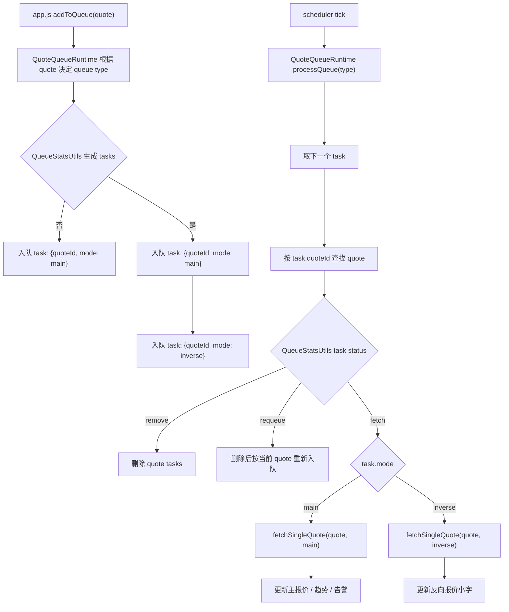

# 请求队列（任务队列版）说明

## 目的

把 `showInverse` 的反向报价纳入队列调度，避免在一次 `fetchSingleQuote()` 中与主向并发请求，降低实际 QPS 放大。

补充：

- 主看板右侧“套利路径”面板不跟着每次报价立即刷新
- 它走单独的节流更新逻辑，当前节流窗口常量是 `ARB_PANEL_UPDATE_DELAY_MS = 1000`
- 含义是：
  - 任意一个主报价成功后，会请求一次套利路径刷新
  - 如果当前已经有一个等待中的套利路径刷新 timer，则新的请求会被忽略
  - timer 到期后只执行一次 `updateArbPanel()`
- 所以当前实际语义是：
  - `最多每 1000ms 重算一次套利路径`
  - 不是“每个报价都立刻重算一次”

## 核心变化

- 旧模型：队列里存 `quote`
  - 轮到一个 `quote` 后，`fetchSingleQuote()` 里可能同时发 `main + inverse`（并发）
- 新模型：队列里存 `task`
  - 任务结构：`{ quoteId, mode: 'main' | 'inverse' }`
  - 每次 scheduler tick 只处理一个任务，因此 `1 tick ≈ 1 次请求`

## 任务生成规则

- `showInverse = false`：只生成 `main` 任务
- `showInverse = true` 且非 `Bybit`：生成 `main` + `inverse` 两个任务
- task 生成、task key、去重入队、删除 quote task、defer 当前 task、managed queue key 和 task 状态判断都由 `queue-stats-utils.js` 统一维护。
- 队列运行态（队列、当前索引、timer）和 `processQueue()` / `updateSchedulers()` 状态机由 `quote-queue-runtime-utils.js` 统一维护。
- `app.js` 只负责提供当前业务依赖：quote 列表、请求通道配置、暂停状态、活跃请求判断，以及在 task 状态为 `fetch` 时调用 `fetchSingleQuote()`。

## 当前有几个队列

默认数据源有 `9` 类：

- `kyber`
- `zerox`
- `velora`
- `lifi`
- `bybit`
- `binance`
- `solana`
- `sui`
- `starknet`

如果启用请求通道，支持通道的 source 会形成 `source:channel` 队列，例如 `kyber:default`、`kyber:hk-1`。不支持通道的 source，例如 `bybit` / `binance` / `sui`，仍使用单队列 key。

队列选择规则：

- `Bybit` 走 `bybit`
- `Binance` 走 `binance`
- `solana` 走 `solana`
- `sui` 走 `sui`
- `starknet` 走 `starknet`
- EVM 链里：
  - `preferredSource = '0x'` 走 `zerox`
  - `preferredSource = 'Velora'` 走 `velora`
  - `preferredSource = 'LI.FI'` 走 `lifi`
  - 其他默认走 `kyber`
- `toChain` 存在且不同于 `chain` 的跨链报价强制走 `LI.FI`

## 队列与执行逻辑

1. `app.js` 收到新增、编辑、切换 source/channel/showInverse 等事件后调用本地入口 `addToQueue(quote)`
2. `quote-queue-runtime-utils.js` 按数据源类型（`kyber/zerox/velora/lifi/bybit/binance/solana/sui/starknet` 或 `source:channel`）决定进入哪个队列
3. `queue-stats-utils.js` 把 `quote` 展开成一个或两个任务（`main`、`inverse`），并负责去重
4. `quote-queue-runtime-utils.js` 的 `processQueue(type)` 每次轮询取出一个任务
5. 运行时通过 `task.quoteId` 找到当前 quote 配置，并让 `queue-stats-utils.js` 判断 task 状态
6. task 状态为 `fetch` 时，运行时调用 `app.js` 注入的 `fetchSingleQuote(quote, task.mode)`
7. `main` 模式更新主价格/趋势/告警
8. `main` 模式成功后会请求一次套利路径刷新，但当前有 `1000ms` 节流窗口
9. `inverse` 模式只更新反向小字，不触发主价格告警逻辑

## 为什么更好

- 队列语义更清晰：队列里就是“请求任务”
- QPS 更容易估算：每次 tick 最多发 1 个请求
- 反向报价天然遵守队列和间隔，不再绕过 scheduler
- 不需要维护 `main/inverse` 相位状态（phase）

## 队列之间是否并行

是，并行。

- 每个队列都有自己独立的 `setInterval`
- `updateSchedulers()` 会给每个队列分别启动一个 timer
- 所以 `kyber / zerox / velora / lifi / bybit / binance / solana / sui / starknet` 之间可以同时跑

但每个单独队列内部仍然是串行节奏：

- 一个 queue 的一次 tick 只会处理一个 task
- 同一个 quote 如果上一次请求还没结束，`processQueue()` 不会重复发，而是把当前任务 defer 到队尾
- 这个保护依赖 `activeFetchControllerRuntime.has(quote.id)`

所以更准确地说：

- `队列内`：按 tick 串行轮询
- `队列间`：并行
- `同一 quote`：不会并发重复请求

## 当前默认间隔

- `kyber`: `170ms`
- `zerox`: `110ms`
- `velora`: `700ms`
- `lifi`: `170ms`
- `bybit`: `1000ms`
- `binance`: `1000ms`
- `solana`: `3500ms`
- `sui`: `500ms`
- `starknet`: `1000ms`

这些值可以在设置面板里改，改完会重新 `updateSchedulers()`。

## 与套利路径面板的关系

右侧“套利路径”面板和请求队列不是同一套 timer。

- 报价队列负责拉 quote
- 套利路径面板负责读取当前最新 quote 状态后做路径计算和渲染
- 当前路径面板走一个单独节流器：`ARB_PANEL_UPDATE_DELAY_MS = 1000`
- LI.FI 跨链报价不进入当前套利路径拓扑，避免把桥接路线当成同链可闭环交易腿

触发顺序是：

1. 某个 `main` 报价成功
2. 更新 `quoteMarketState`
3. 调用 `scheduleArbUpdate()`
4. 如果当前没有等待中的路径刷新 timer，则创建一个 `1000ms` timer
5. timer 到期后执行一次 `updateArbPanel()`

这意味着：

- 多个报价如果落在同一个 `1000ms` 窗口里，只会合并成一次路径刷新
- 当前路径面板是“节流更新”，不是固定周期轮询

## 与套利详情弹窗的关系

套利详情弹窗不复用主看板队列。

- 详情弹窗走单独的循环
- 打开详情弹窗后，主看板 scheduler 会暂停
- 详情弹窗内部另外按 source budget 控频
- 关闭详情弹窗后，主看板 scheduler 再恢复

所以你看到的“主看板队列”只指实时看板这一套，不包含套利详情弹窗里的详情刷新循环。

## 流程图

## 注意事项

- `showInverse` 开关变化时需要 `removeFromQueue(quote.id)` 后再 `addToQueue(quote)`，以重建任务列表
- 启动时已注释 burst 首刷，避免与 scheduler 并行造成瞬时放大
- 如果要改队列索引、timer 或 active request defer 规则，应优先改 `quote-queue-runtime-utils.js` 并补 `tests/quote-queue-runtime-utils.test.js`
